# 高仿哔哩哔哩APP

> A Vue.js project

## 项目描述

实现像哔哩哔哩APP中的视频的分类及浏览

## 技术描述

1、项目使用vue全家桶(vue+vue-router+vuex+axios)，并基于Vue 2.0的Muse-UI库开发

2、使用vuex状态管理和Muse-UI库实现历史记录模块和我的收藏模块的添加删除功能

3、使用vue中的过渡类名实现组件页面显示隐藏的过渡动画效果

4、使用axios完成ajax请求并实现数据的交互，同时使用了superagent做后台代理

5、使用better-scroll实现多处页面的纵向滚动及频道分类导航栏的横向滚动，及页面的上拉加载

6、采用sass预编译语法扩展css；使用vue-lazyload懒加载图片；使用swiper实现首页轮播图

7、采用数组的filter方法实现模糊查询的功能

8、使用js的移动端触摸事件和ES6的模板字符串实现视频控件的制作及全屏显示的功能

9、使用HTML5的sessionStorage本地储存实现本地登录的实现

## Build Setup

``` bash
# install dependencies
npm install

# serve with hot reload at localhost:8080
npm run dev

# build for production with minification
npm run build

# build for production and view the bundle analyzer report
npm run build --report
```

For a detailed explanation on how things work, check out the [guide](http://vuejs-templates.github.io/webpack/) and [docs for vue-loader](http://vuejs.github.io/vue-loader).

## 安装的三方库

``` bash
npm i vuex -S

npm i vue-router -S

npm i vue-lazyload -S

npm i axios -S

npm i vue-axios -S

npm i muse-ui -S

npm i better-scroll -S

npm i jsonp -S

npm i swiper -S

npm i sass-loader node-sass -D

npm i superagent -D
```

## 项目效果图

### 未登录


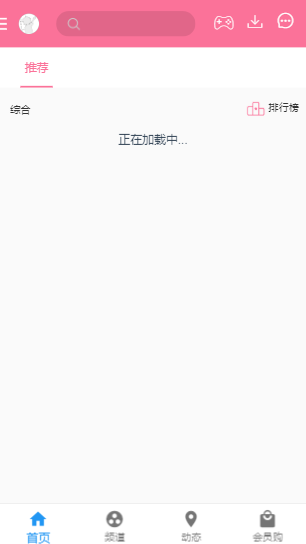
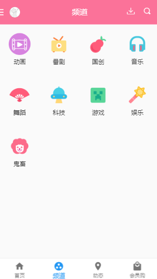


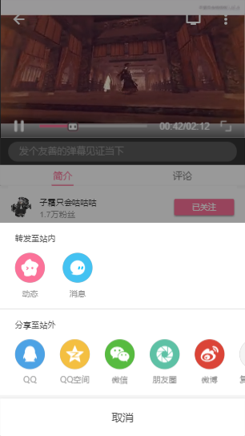


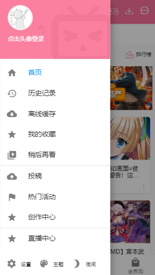
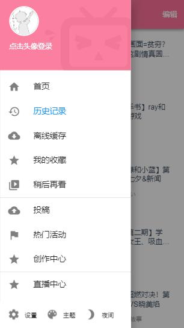


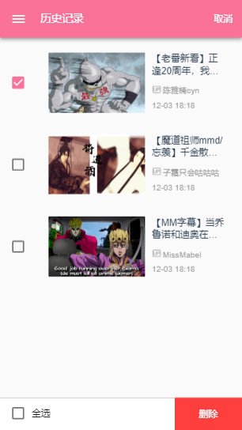
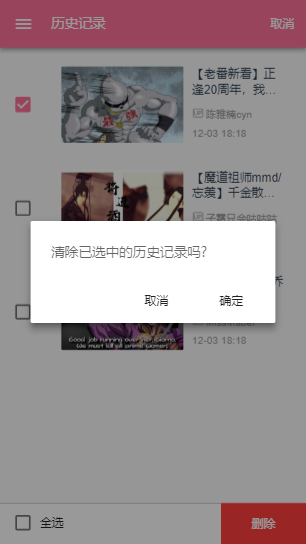

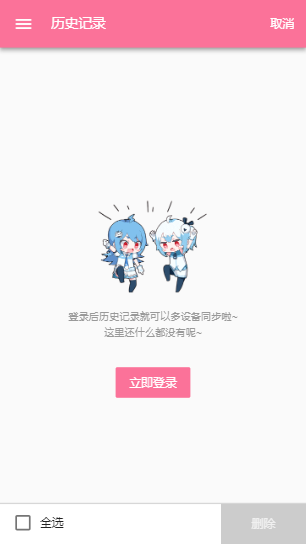


### 已注册

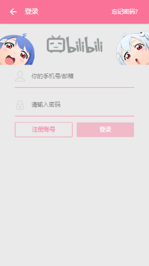
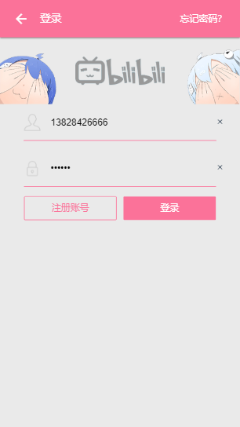
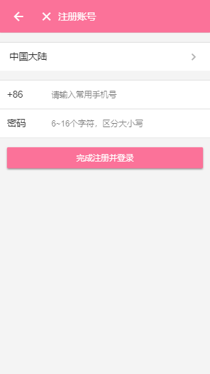
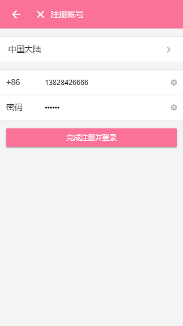
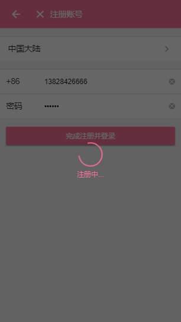
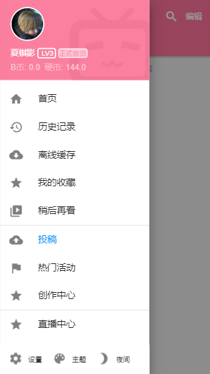
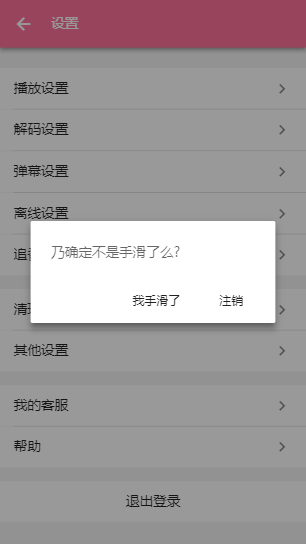


